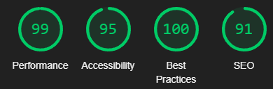

# Clash of Dev

Ma participation au Clash of Dev.

## Critères

### Performances

Le site est optimisé au niveau des images, qui sont des WEBP compressés. Le score de performances sont ainsi élevées. Tous les assets sont minifiés au possible, et le chargement est différé pour assurer un site rapide.

### Accessibilité A11Y

Le site est accessible au possible, navigable au clavier. Les seuls points d'amélioration sont au niveau des contrastes de couleur. J'ai fait le choix de garder les couleurs de la maquette, l'objectif principal étant de garder les couleurs de la maquette.

Les éléments sémantiques HTML sont utilisés au possible: cela permet de minimiser l'utilisation du aria. La règle n°1 du aria étant de ne pas l'utiliser: les tags aria sont une rustine lorsque l'on utilise mal l'HTML déjà à notre disposition. J'en ai utilisé à quelques endroits précis.

Une fausse bonne idée est au niveau des images: j'ai volontairement laissé des alt="", pour les images inutiles. Il s'agit là de la bonne pratique, les lecteurs d'écran savent qu'ils peuvent passer cette image, qui n'apporte rien. La mauvaise pratique est de ne pas mettre d'alt du tout.

## Easter Egg

L'Easter Egg est accessible via le "Switch" situé en haut à droite de l'écran.

Il s'agit d'une petite énigme où l'on droit retrouver un code perdu.

Ce code est le suivant: HAUT, HAUT, BAS, BAS, GAUCHE, DROITE, GAUCHE, DROITE, B, A, ENTRÉE
